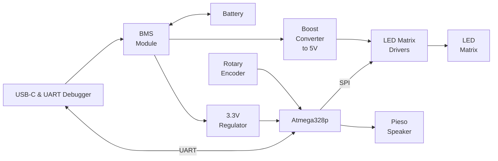
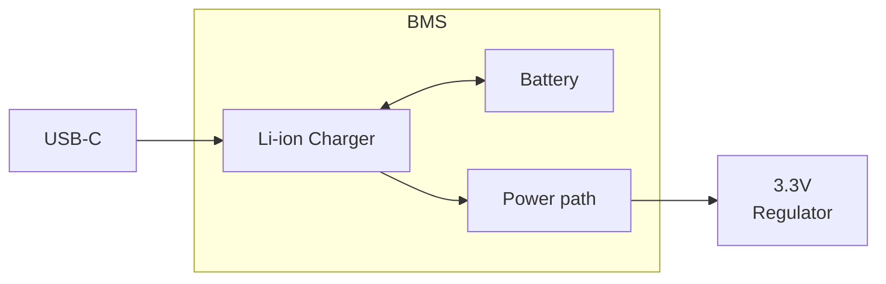

# PCB Design
In this section we outline the design of our PCB.

## System Block Diagram

## Power Requirements
| **Component**                  	| **Voltage** 	| **Avg Current Draw** 	| **Qty** 	| **Total Current Draw** 	|
|--------------------------------	|-------------	|------------------	    |---------	|------------------------	|
| USB-C & UART Debugger             | 5V by USB    	| 15mA             	    | 1       	| 15mA                     	|
| BMS Module                        | 5V by USB    	| 5mA                 	| 1       	| 5mA                      	|
| Microcontroller (ATmega328p)   	| 3.3V        	| 5mA                	| 1       	| 5mA                      	|
| LED Matrix Drivers (MAX7219)   	| 5V          	| 20mA           	    | 4       	| 80mA                   	|
| LED Matrix 8x8 (KWM-20882XUYB) 	| 5V         	| 320mA (at 25% LEDs)  	| 4       	|                        	|
| Piezo Speaker                  	| 5V          	| 20mA              	| 1       	| 20mA                     	|
| Rotary Encoder                 	| 3.3V or 5V   	| 1mA               	| 1       	| 1mA                    	|

* Boost Converter and Regulator Efficiency: Assume ~85% efficiency for both.
* LED Matrix: Assume 25% of LEDs, on average, will be on at the same time.
* The UART debugger should only be powered when the USB is connected.

Total Current Draw (1 + 0.15) = 1617mA

## Battery:
### Battery Requirements:
* Can run for 4hrs at a "worst case scenario" consumption rate: Total Current Draw = 1617mA
* Light weight.

### Battery Design:
We chose a LiPo battery. It provides 3.7V

[TODO]
* [ ] Calculate capacity
* [ ] Chose battery size

## BMS Module:
### BMS Requirements:
* Battery charging capabilities
* Battery protection
* Power the load without disconnecting the battery.

### BMS Design:
We chose to use the "TP4056 module with the DW01 IC". It provides battery charginc capabilities, under-voltage, over-current and over-voltage protection [[1]](#1). The board contains a TP4056 IC (Lithium Battery Charging IC) and a DW01 IC (battery protection IC).

A problem with this module is that the load must be disconnected when the battery is being charged. To solve this, we can use the "power path" circuit shown in "GitHub TP4056-Power-Path-PCB" [[2]](#2).

The module can be soldered directly into our PCB to avoid building this block on our own. The only modification needed is to change the TP4056 current programming resistor, usually named R3.

## USB-C & UART Debugger
[TODO]
* [ ] Since the UART debugger will not be powered unless the USB-C is connected, use series resistors on UART lines between the MCU and the module to limit potential backfeed. Too high value resistors reduce chance of backfeed but degrade the signals. Too low values do the oposit. Start with 4.7k and test if current flow backwards.

## Piezo Speaker
### Piezo Speaker Requirements
We did not have specific requirements for the speaker.
### Piezo Speaker Design
The Piezo Speaker chosen work at 3.3V. We will be powering it directly from the GPIO pin of the MCU. [TODO] Maybe it would be a good idea to power it from the 3.3V Regulator.

## References:
* <a id="1">[1]</a> "Lithium Battery Protection using DW01 and TC4056 Tested and Explained" [www.robojax.com](https://robojax.com/)
* <a id="2">[2]</a> "TP4056-Power-Path-PCB" [GitHub TP4056-Power-Path-PCB](https://github.com/DoImant/TP4056-Power-Path-PCB/blob/main/README.md)

### Components links
| **Component source**             	| **DataSheet**                                                             |
|--------------------------------   |----------------------------------------------------------------           |
|[USB-C & UART Debugger](https://es.aliexpress.com/item/1005004276046811.html?spm=a2g0o.order_list.order_list_main.39.6ba6194doVGuKx&gatewayAdapt=glo2esp)              | [DataSheet](https://cdn.sparkfun.com/assets/5/0/a/8/5/CH340DS1.PDF?utm_source=chatgpt.com)|
|[BMS Module]()|

