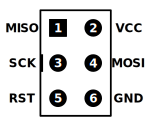

# Kitchen timer

We're building a Kitchen timer!
The project is heavily inspired by [REST: Kitchen timer by mkdxdx [Hackaday.io]](https://hackaday.io/project/194386-rest-kitchen-timer).

## Introduction:
Our kitchen timer will be an iteration of [mkdxdx](https://hackaday.io/mkdxdx) project "REST: Kitchen timerREST: Kitchen timer". We will keep the "dial" (rotate-to-set) concept and the 16x16 led matrix but we want to do it with an ATmega328p and a custom PCB.

Among other features that we would like to add are:
* The possibility to set up several timers (in case you need to keep track of more than one pot when cooking dinner)
* A UART communication port that would allow us to test the device via serial commands.

## Motivation:
Both [Erasmus Cedernaes](https://github.com/emanuelen5) and [Nicolas Perozzi](https://github.com/nperozzi) belong to [Stockholm Makerspace](https://www.makerspace.se/). On the same day, we messaged each other a link to mkdxdx​ project. We were very excited about building something that would be "practical" so we decided to team up and work on this together. Additionally, we share an interest in working with the AVR MCUs. This project is a nice blend of programming, electrical, mechanical, 3d printing, and design but, without feeling overwhelming.

## Product Requirements:
* It needs to allow for several timers to run in parallel.
* Powered by battery
* Charged by USB-C.
* Programmable.
* It needs to be possible to stick to the kitchen fridge.

## Hardware

* Atmega328P as microcontroller
* Rotary encoder for setting the time
* 16x16 LED matrix as display
* 32 kHz crystal for accurate timekeeping
* Passive buzzer for beeping

## Software

The software is divided into several "environments", similar to "sketches" in Arduino. They are used to test different aspects of the hardware individually, to make sure that the assembled hardware works as intended.

The environments are located in the [`src/envs`](./src/envs/) folder.

### Bootloader

You need a bootloader on the microcontroller to be able to program it through the USB connector.

To flash the microcontroller with the bootloader, you need `avrdude` and `pio` (the PlatformIO command line tool).

* Avrdude 7.3 can be downloaded from <https://github.com/avrdudes/avrdude/releases/tag/v7.3>. Make sure to add it to your `PATH`.
* `pio` can be downloaded from <https://pypi.org/project/platformio/> or installed using `pip` (the official Package Installer for Python)

Connect your programmer of choice to the 6-pin in-system programmer (ISP) connector: \

<!--
Attribution:
["6- and 10-pin AVR ISP headers"](https://en.wikipedia.org/wiki/In-system_programming#/media/File:Isp_headers.svg)
by osiixy (2013-01-05), used under [CC BY 3.0](https://creativecommons.org/licenses/by/3.0/).
Adaptations: removed 10-pin header and some text; improved the contrast for dark
             mode.
-->

Then run

```bash
./flash.sh <programmer> bootloader
```

to flash the bootloader and set the fuses (to `lfuse=0x62 hfuse=0xD0 efuse=0xFF`).

### Application

First you will need to install some packages that the programmer needs, and build the application.

```bash
pip install -r ./programmer/requirements.txt
pio run -e application
```

You can now program the application onto the device using the bootloader!

Connect the USB cable to the device, and then run

```bash
python3 ./programmer/programmer.py --hexfile .pio/build/application/firmware.hex
```
