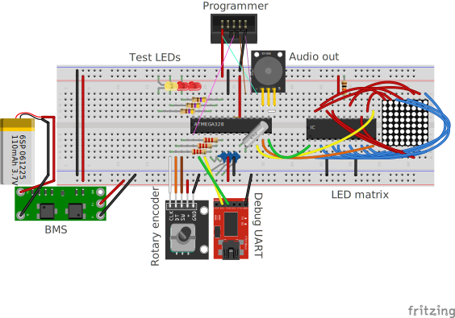

# Kitchen timer

We're building a Kitchen timer!
The project is heavily inspired by [REST: Kitchen timer by mkdxdx [Hackaday.io]](https://hackaday.io/project/194386-rest-kitchen-timer).

## Hardware

* Atmega328P as microcontroller
* Rotary encoder for setting the time
* 16x16 LED matrix as display
* 32 kHz crystal for accurate time keeping
* (Passive?) buzzer for beeping

### Schematic

Prototyping setup on the breadboard:

## Software

The software is divided into several "environments", similar to "sketches" in Arduino. They are used for testing different aspects of the hardware individually, to make sure that the assembled hardware works as intended.

The environments are located in the [`src/envs`](./src/envs/) folder.

### Programming

To be able to program the microcontroller, you need `avrdude`.

* Avrdude 7.3 can be downloaded from <https://github.com/avrdudes/avrdude/releases/tag/v7.3>.
