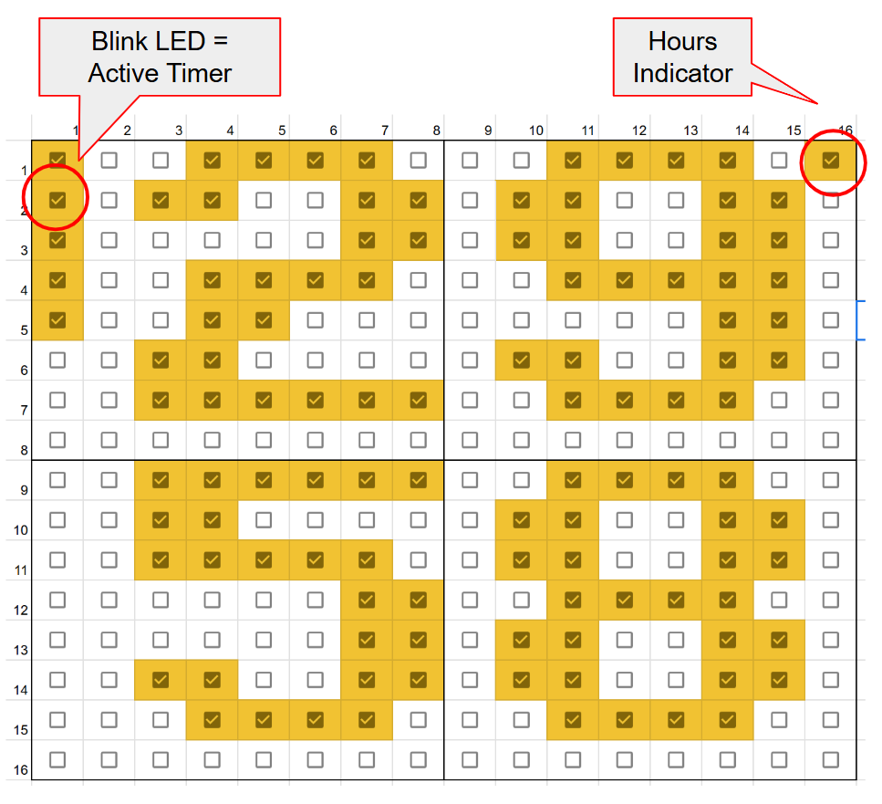
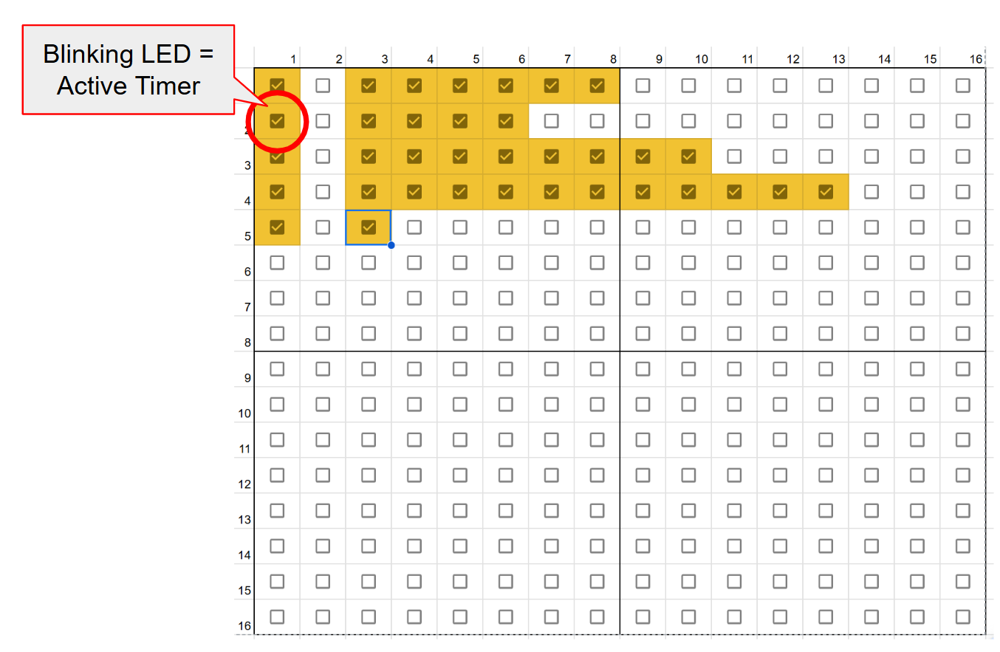

# Kitchen Timer Functionality
The purpose of this file is to define how the functionality of the Kitchen Timer works.

## Views:
### Timer View
The Kitchen Timer can run multiple countdown timers simultaneously, but only one can be displayed at a time. The timer being shown is called the Active Timer.
The "Timer view" displays:
* Active Timer
* Timers Indicator
* Hour Indicator

#### Active Timer
*  If the represented time is less than 60 minutes, the top two digits represent minutes and the bottom two digits, seconds. If the time is larger than 60 minutes, the top digits represent hours and the bottom two, minutes.
* The font for the digits is a 7x6 fat pixel font.

#### Timers Indicator
The left-most column of LEDs is reserved for indicating how many timers are currently in use.
* The corresponding LED indicator is on when the timer is RUNNING or PAUSED.
* The Active Timer is identified in the Timers Indicator as the blinking LED.
* When a timer goes off, it becomes automatically the Active Timer, and an LED will turn on in the second column. This last feature is particularly helpful when more than one timer is ringing simultaneously.
* When opening a new timer, the system will choose the next top-most available timer and make it the Active Timer.

#### Hour Indicator
To highlight that the top two digits represent hours and not minutes, the Hours Indicator lights up.

### Bars View
The Bars View shows the status of each timer in relationsip to the others as a horizontal bar diagram. In the same way as in the Timer View, the left-most column is the Timers Indicator, and the blinking LED is the Active Timer.

## Timer State Machine table
A table indicating what happens in each state when each event happens.

| | Rot CW/CCW | SINGLE PRESS | DOUBLE PRESS | LONG PRESS | PRESS Rot. CW/CCW | SECOND_TICK | TIMEOUT |
| - | - | - | - | - | - | - | -  |
| IDLE | up/down original_time | RUN | New Timer | Reset original_time | Next/Prev Timer | NA | NA |
| SET_TIME | 
| RUN | Change View | PAUSE | New Timer | IDLE | Next/Prev Timer | down current_time | RING   Ringing Timer becomes the Active Timer. |
| PAUSE | Change View | RUN | New Timer | IDLE | Next/Prev Timer | NA | NA |
| RING  | NA | IDLE | NA | IDLE | NA | NA | After 20 secs, switch to IDLE |

*If there are no more space for timers, the Timer Indicator should blink a few timer to show that the amount of timer reached a limit.
