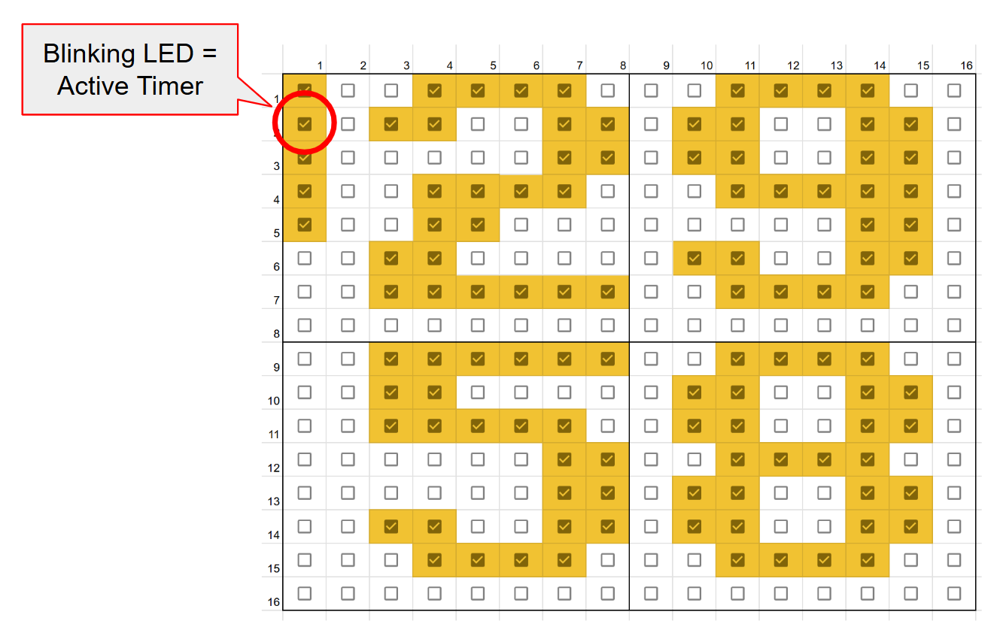

# Kitchen Timer Functionality
The purpose of this file is to define how the functionality of the Kitchen Timer works.

## Views:
### Timer View
The Kitchen Timer can run multiple countdown timers simultaneously, but only one can be displayed at a time. The timer being shown is called the Active Timer.
The "Timer view" displays:
* Active Timer
* Timers Indicator

#### Active Timer
*  The 2 top digits represent the minutes, and the 2 lower digits represent the seconds.
* The font for the digits is a 7x6 fat pixel font.

#### Timers Indicator
The left-most column of LEDs is reserved for indicating how many timers are currently running. For example, if there are 5 LEDs on, that means that there are 5 timers running. The Active Timer is identified in the Timers Indicator as the blinking LED.

### Bars View
The Bars View shows the status of each timer in relationsip to the others as a horizontal bar diagram. In the same way as in the Timer View, the left-most column is the Timers Indicator, and the blinking LED is the Active Timer.

## Timer State Machine table
A table indicating what happens in each state when each event happens.

| | Rot CW/CCW | SINGLE PRESS | DOUBLE PRESS | LONG PRESS | PRESS Rot. CW/CCW | SECOND_TICK | TIMEOUT |
| - | - | - | - | - | - | - | -  |
| IDLE | up/down original_time | RUN | New Timer | Reset original_time | Change View | NA | NA |
| RUN | NA | PAUSE | New Timer | IDLE | Change View | down current_time | RING   Ringing Timer becomes the Active Timer. |
| PAUSE | NA | RUN | New Timer | IDLE | Change View | NA | NA |
| RING  | NA | IDLE | NA | IDLE | NA | NA | After 20 secs, switch to IDLE |
