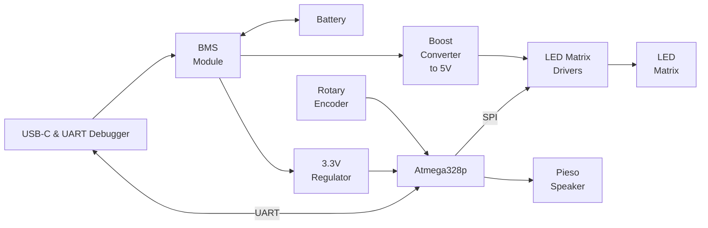

## System Block Diagram
In this section we include the system block diagram.

```mermaid
graph LR;
    A[USB-C & UART Debugger];
        A --> B;
        A <-->|UART| E;
    B[BMS<br> Module];
        B <--> C;
        B --> D;
        B --> J;
    C[Battery];
    D[3.3V<br> Regulator];
        D --> E;
    E[Atmega328p];
        E -->|SPI| F;
        E --> I;
    F[LED Matrix<br> Drivers];
        F --> G;
    G[LED<br> Matrix];
    H[Rotary<br> Encoder];
        H --> E;
    I[Pieso<br> Speaker];
    J[Boost<br> Converter<br> to 5V]
        J --> F    
```
