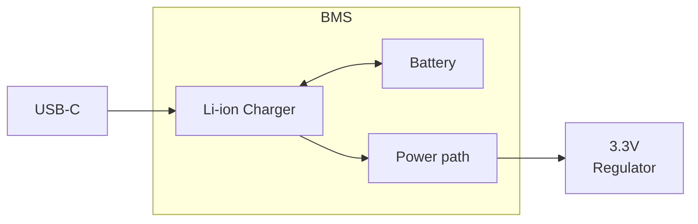

# Bill of Materials Documentation
In this section we document the choices for the components used.

## Power Requirements
| **Component**                  	| **Voltage** 	| **Avg Current Draw** 	| **Qty** 	| **Total Current Draw** 	|
|--------------------------------	|-------------	|------------------	    |---------	|------------------------	|
| USB-C & UART Debugger             | 5V by USB    	| 15mA             	    | 1       	| 15mA                     	|
| BMS Module                        | 5V by USB    	| 5mA                 	| 1       	| 5mA                      	|
| Microcontroller (ATmega328p)   	| 3.3V        	| 5mA                	| 1       	| 5mA                      	|
| LED Matrix Drivers (MAX7219)   	| 5V          	| 20mA           	    | 4       	| 80mA                   	|
| LED Matrix 8x8 (KWM-20882XUYB) 	| 5V         	| 320mA (at 25% LEDs)  	| 4       	| 1280mA                   	|
| Piezo Speaker                  	| 5V          	| 20mA              	| 1       	| 20mA                     	|
| Rotary Encoder                 	| 3.3V or 5V   	| 1mA               	| 1       	| 1mA                    	|

* Boost Converter and Regulator Efficiency: Assume ~85% efficiency for both.
* LED Matrix: Assume 25% of LEDs, on average, will be on at the same time.
* The UART debugger should only be powered when the USB is connected.

Total Current Draw + 15% to compensate for loses in boost converter and regulator = 1594mA (~1600mA)

## Battery:
### Battery Requirements:
* Can run for 2hrs of at a "worst case scenario" (full current consumption of ~1600mA).
* Light weight.

### Battery Design:
We want to use a one cell LiPo battery that provide 3200mAh at 3.7V. 

[TODO]
* [ ] Find a battery that suits us.

## BMS Module:
### BMS Requirements:
* Battery charging capabilities
* Battery protection
* Power the load without disconnecting the battery.

### BMS Design:
We chose to use the "TP4056 module with the DW01 IC". It provides battery charginc capabilities, under-voltage, over-current and over-voltage protection [[1]](#1). The board contains a TP4056 IC (Lithium Battery Charging IC) and a DW01 IC (battery protection IC).

A problem with this module is that the load must be disconnected when the battery is being charged. To solve this, we can use the "power path" circuit shown in "GitHub TP4056-Power-Path-PCB" [[2]](#2).

The module can be soldered directly into our PCB to avoid building this block on our own. The only modification needed is to change the TP4056 current programming resistor, usually named R3.

[TODO]
* [ ] It would be possible to add a voltage devider and connected to the MCU to measure battery voltage.[[3]](#3)

## USB-C & UART Debugger
[TODO]
* [ ] Since the UART debugger will not be powered unless the USB-C is connected, use series resistors on UART lines between the MCU and the module to limit potential backfeed. Too high value resistors reduce chance of backfeed but degrade the signals. Too low values do the oposit. Start with 4.7k and test if current flow backwards.

## 3.3V Regulator
### Requirements
* Support a 26mA current draw for our battery powered device.
### Choice:
We will use a BL9110 iC. 

## Boost Converter to 5V
[TODO]

## Microcontroller (ATmega328p)
### MCU Requirement
We want to work with an AVR MCU.
### MCU choice:
We will use the ATmega328p in its surface mount version.

## LED Matrix Drivers (MAX7219)
[TODO]
## LED Matrix 8x8 (KWM-20882XUYB)
[TODO]
## Rotary Encoder
[TODO]
## Piezo Speaker
### Piezo Speaker Requirements
We did not have specific requirements for the speaker.
### Piezo Speaker Design

The Piezo Speaker chosen work at 3.3V. We will be powering it directly from the GPIO pin of the MCU. [TODO] Maybe it would be a good idea to power it from the 3.3V Regulator.

## References:
* <a id="1">[1]</a> [www.robojax.com "Lithium Battery Protection using DW01 and TC4056 Tested and Explained"](https://robojax.com/learn/arduino/?vid=robojax_DW01_with_4056_Protection)
* <a id="2">[2]</a> [GitHub "TP4056-Power-Path-PCB"](https://github.com/DoImant/TP4056-Power-Path-PCB/blob/main/README.md)
* <a id="3">[3]</a> [Hackaday "Lithium-Ion Batteries Power Your Devboards Easily"] (https://hackaday.com/2024/03/14/lithium-ion-batteries-power-your-devboards-easily/)

### Components links
| **Component source**             	| **DataSheet**                                                             |
|--------------------------------   |----------------------------------------------------------------           |
|[UART Module](https://es.aliexpress.com/item/1005004276046811.html?spm=a2g0o.order_list.order_list_main.39.6ba6194doVGuKx&gatewayAdapt=glo2esp)              | [DataSheet](https://cdn.sparkfun.com/assets/5/0/a/8/5/CH340DS1.PDF?utm_source=chatgpt.com)|
| [BMS Module](https://www.electrokit.com/batteriladdare-lipo-microusb)| [DataSheet](https://dlnmh9ip6v2uc.cloudfront.net/datasheets/Prototyping/TP4056.pdf)
| [3.3 Regulator AP2111H-3.3TRG1](https://www.digikey.se/en/products/detail/diodes-incorporated/AP2111H-3-3TRG1/4470743)    | [DataSheet](https://mm.digikey.com/Volume0/opasdata/d220001/medias/docus/657/AP2111_Dec2012_DS.pdf) |
|[Dot-Matrix LED 8x8 common-cathode yellow](https://www.electrokit.com/punktmatris-led-8x8-20.32mm-cc-gul)|[DataSheet](https://www.electrokit.com/upload/product/41015/41015151/860datasheet.pdf)|
|[Active piezo buzzer](https://www.electrokit.com/summer-4-khz-miniatyr)|[TODO]|
|[Rotary Encoder PEC11R-4215F-S0024](https://www.digikey.se/en/products/detail/bourns-inc/PEC11R-4215F-S0024/4499665)|[DataSheet](https://www.bourns.com/docs/Product-Datasheets/PEC11R.pdf)|
