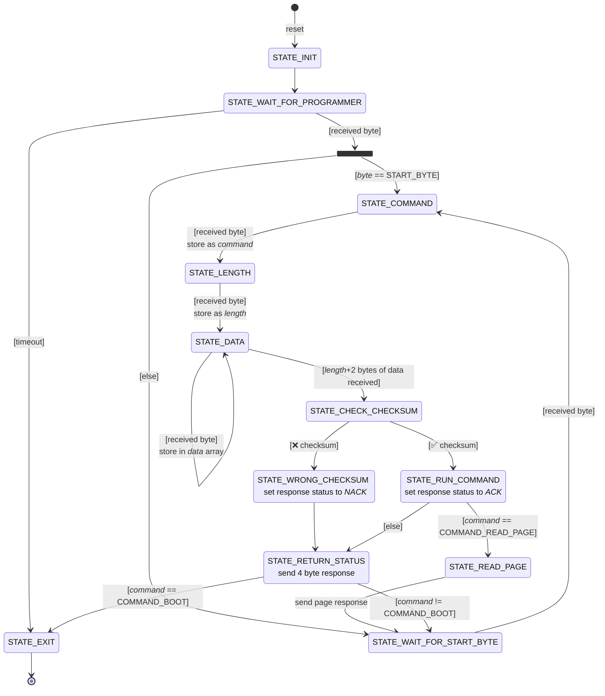

# State machine

- The bootloader state machine starts at `STATE_INIT` ⚡, *resets*, and waits for the programmer.
- ⏳ If no programmer sends any command within a timeout, it automatically *exits*.
- It transitions through states as it receives bytes: start byte, command, length, and data.
- After collecting data, it checks the checksum.
- If the checksum is wrong, the device responds with a *NAK* ❌; if correct, it *runs the command* and responds with an *ACK* ✅.
- Most commands return a status; `COMMAND_READ_PAGE` 📖 *sends a page response*.
- In `STATE_RETURN_STATUS`, the bootloader sends a response packet back to the programmer.
- In `STATE_READ_PAGE`, the bootloader sends the requested page data as a response.
- If the command is `COMMAND_BOOT` 🚀, the state machine *exits*; otherwise, it loops back to wait for the next command.
