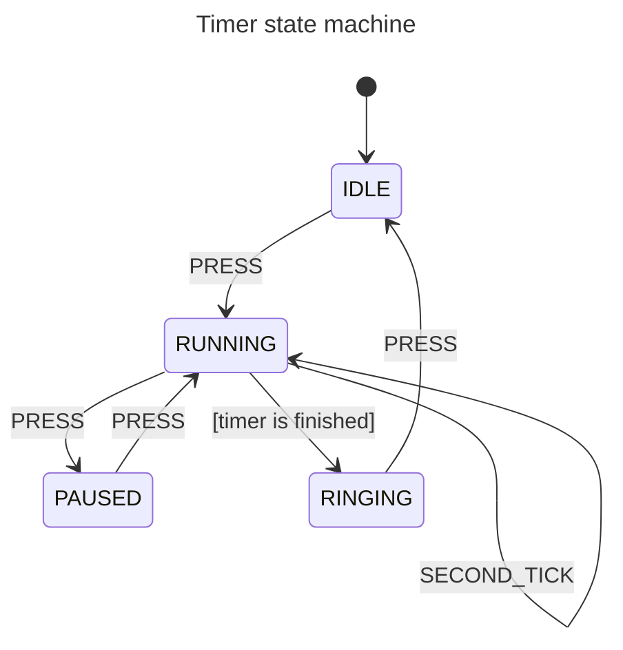

# State machine

```mermaid
---
title: Timer state machine
---

stateDiagram-v2
    [*] --> IDLE

    IDLE --> RUNNING: PRESS

    RUNNING --> PAUSED: PRESS
    RUNNING --> RUNNING: SECOND_TICK

    PAUSED --> RUNNING: PRESS

    RUNNING --> RINGING: [timer is finished]

    RINGING --> IDLE: PRESS
```
